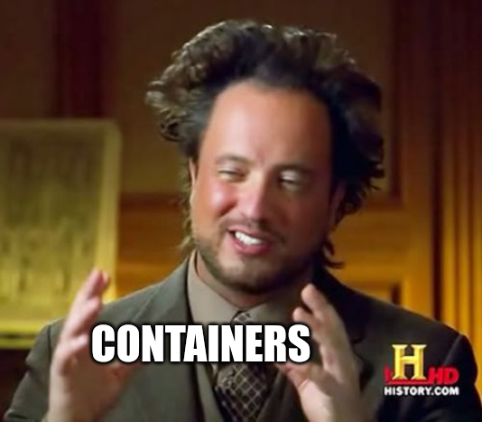

# DevOps Docs - Docs as Code

## Dev enviornment

How to set your own dev enviornment?



``` bash
  git clone https://github.com/facundoHernandez/devops-docs.git && cd ./devops-doc
  
  git checkout -b dev

  docker build -t devops-doc .

  docker run -p 1313:1313 -v $(pwd):/src devops-doc server

  If you want terminal detached run

  docker run -d -p 1313:1313 -v $(pwd):/src devops-doc server

```
Now you can access to check your changes http://localhost:1313